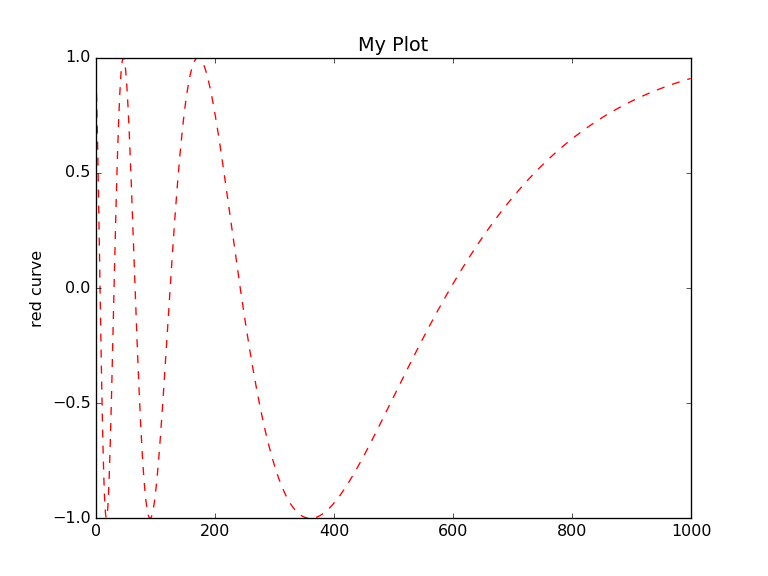
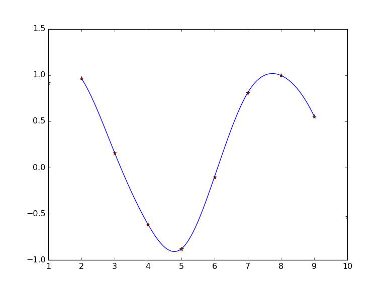

[](weave("lectures/julia_install_arrays_packages/julia_install_arrays_packages.mdw", plotlib="PyPlot", doctype="github"))


#  Why I'm excited about Julia

* Open source
* High level matlab-like syntax
* Fast like C (often one can get within a factor of 2 of C)
* Made for scientific computing (matrices first class, linear algebra support, native fft ...)
* Modern features like:
  - Macros,
  - closures,
  - pass by reference,
  - OO qualities,
  - modules
  - code can be written in Unicode ( I'll never write sqrt(2) again. instead √(2) )
  - parallelism and distributed computation
  - powerful shell programming
  - named and optional arguments
  - julia notebooks
* I can finally write fast loops (not to be underestaimted)
* Since it is fast most of julia is written in julia
* Since it is high level, the source is actually readable (and a good way to learn)
* Julia interacts with python so well, any of the missing functionality can be called out to python


Installation
=============================================

There are three ways to install Julia: compile from source, download the binaries, use [homebrew](http://brew.sh).


### Compile from source
I compile Julia from source and usually put it in a directory called `Software`. You will first need to make sure you have the command line arguments installed (if your on a mac). First download X-code from the mac store and then enter `xcode-select --install` at the terminal. Now you need up-to-date gcc (and other stuff). I use homebrew for this.
```
brew install gcc
brew install Caskroom/cask/xquartz
brew install cmake
```
Once these are installed I do the following
```
cd Software
git clone -b release-0.4 git://github.com/JuliaLang/julia.git julia4
cd julia4
make
```
If this works, add `export PATH="/Users/ethananderes/Software/julia4/:$PATH"` (with `/Users/ethananderes` replaced by the path on your machine) to your `.bash_profile` and you should be able to call `julia` from the terminal.


### Download binaries
Probably the easiest way to install the Julia binaries is with homebrew (follow instructions [here](https://github.com/staticfloat/homebrew-julia/)).

If you don't want to use homebrew, you can download the binaries directly from [julialang.com](julialang.com) but you will need to add the path to Julia in your `.bash_profile` if you do it that way.


### Getting help

The documentation found at [julialang.com](julialang.com) is pretty good. You can also ask questions on Google groups (search julia). The Julia community is pretty friendly and they welcome beginners so don't hesitate to ask for help.


Python
=============================================
Most of the code you will write in this class will be in Julia. However, Physicists traditionally use python for all their data analysis so we will need to call some of the python modules written specifically for CMB analysis. Lucky python and Julia work amazing well together so this will not be a problem. If you already have python working (and have numpy, matplotlib, etc installed and working) then your already ready to go. If not, then I recommend installing anaconda which will automatically install everything we need.

To install Anaconda I recommend using the command-line installer (instructions [here](https://www.continuum.io/downloads)).

Once Anaconda is installed you can add packages using something like `conda install ...` for packages registered with conda. If you want to install a package not registered with conda you can do something like the following example (to install Pweave in python)
```
conda config --add channels mpastell
conda install pweave
```

If, at any time, you need to update Anaconda just enter the following at the terminal.
```
conda update conda
conda update anaconda
```


Julia basics
=======================================

Using Julia as a calculator.
````julia
julia> a = 1 + sin(2)
1.9092974268256817

julia> b = besselj(2, a ^ 2)
0.4376457719304935

julia> d = sin(a * b * π)
0.49383153154679066

````


Shell mode, help mode and namesapce variables
```
shell>  pwd
/Users/ethananderes/Dropbox/Courses

shell>  cd ..
/Users/ethananderes/Dropbox

help?>  besselj
search: besselj besseljx besselj1 besselj0 bessely besselk besseli besselh besselyx bessely1 bessely0 besselkx besselix besselhx


julia> whos() # variables in my namespace
```


Run a file of Julia source
```julia
include("run.jl")
```

Exit REPL and quit
```
quit()
```

To uninstall Julia, just remove binaries (this should just be one directory) and `~/.julia/`.


Intro to multidimensional arrays
=======================================
In this class you will mostly work with multidimensional arrays. These are lightweight mutable containers.


Here are a few ways to construct arrays
````julia
julia> vec1 = [1, 2, 3]  # a list (i.e. vector)
3-element Array{Int64,1}:
 1
 2
 3

julia> mat1 = [1.1 2.0 3; 4 5 6] # a matrix.
2x3 Array{Float64,2}:
 1.1  2.0  3.0
 4.0  5.0  6.0

julia> mat2 = randn(3,4)  # a matrix with N(0,1) entries.
3x4 Array{Float64,2}:
 -0.626719  -0.786839   -0.7275    1.73395 
  0.266242  -0.21617    -0.285678  0.340494
  2.8814    -0.0782368  -1.86271   0.107728

julia> mat3 = zeros(2,2,2)  # a 2x2x2 multidimentional array
2x2x2 Array{Float64,3}:
[:, :, 1] =
 0.0  0.0
 0.0  0.0

[:, :, 2] =
 0.0  0.0
 0.0  0.0

julia> mat4 = eye(5)  #<--- 5 x 5 idenity matrix
5x5 Array{Float64,2}:
 1.0  0.0  0.0  0.0  0.0
 0.0  1.0  0.0  0.0  0.0
 0.0  0.0  1.0  0.0  0.0
 0.0  0.0  0.0  1.0  0.0
 0.0  0.0  0.0  0.0  1.0

````


Accessing submatrices and elements of an array.
````julia
julia> row   = [1  2  4  6]  # rows are two dimensional
1x4 Array{Int64,2}:
 1  2  4  6

julia> mat2[1, 2] # first row, second column
-0.7868385630749404

julia> mat2[1, :] # first row
1x4 Array{Float64,2}:
 -0.626719  -0.786839  -0.7275  1.73395

julia> mat2[:, 2] # second column...trailing degenerate dimensions are removed
3-element Array{Float64,1}:
 -0.786839 
 -0.21617  
 -0.0782368

julia> mat2[1:3, 7:end] # matrix sub block
3x0 Array{Float64,2}

julia> mat2[:]  # stacks the columns
12-element Array{Float64,1}:
 -0.626719
  0.266242
  2.8814  
 -0.786839
 -0.21617 
  ⋮       
 -0.285678
 -1.86271 
  1.73395 
  0.340494
  0.107728

````


Arrays are mutable so you can allocate them and fill in their entries
````julia
julia> mat5 = Array(Float64, 2,3)  # allocate a 2x3 array with Float64 entries
2x3 Array{Float64,2}:
 4.24399e-314  0.0  2.26914e-314
 1.061e-314    0.0  2.26914e-314

julia> mat5[1,2] = 0  # change the 1,2 entry to 0.0
0

julia> mat5[5] = 1000 # change the 5th entry (in column major ordering)
1000

julia> mat5
2x3 Array{Float64,2}:
 4.24399e-314  0.0  1000.0         
 1.061e-314    0.0     2.26914e-314

julia> mat5[:,1] = 22 # change everything in first column to 22 and supress output
22

julia> mat5
2x3 Array{Float64,2}:
 22.0  0.0  1000.0         
 22.0  0.0     2.26914e-314

julia> mat5[:]   = rand(2,3)  # replace all entries of mat5 with U(0,1) entries
2x3 Array{Float64,2}:
 0.348128   0.488032   0.963199
 0.0657757  0.0928857  0.938046

````


Vectorize operations
````julia
julia> mat1 = eye(2)
2x2 Array{Float64,2}:
 1.0  0.0
 0.0  1.0

julia> mat2 = randn(2,2)
2x2 Array{Float64,2}:
 -1.62956   -0.0244404
 -0.346205   0.927838 

julia> mat2 .^ 2 # .^ is coordinstewise power
2x2 Array{Float64,2}:
 2.65547   0.000597332
 0.119858  0.860884   

julia> exp(mat2)
2x2 Array{Float64,2}:
 0.196016  0.975856
 0.707367  2.52904 

julia> mat1 .* mat2
2x2 Array{Float64,2}:
 -1.62956  -0.0     
 -0.0       0.927838

julia> mat2 .<= 0
2x2 BitArray{2}:
 true   true
 true  false

julia> mat1 .<= mat2
2x2 BitArray{2}:
 false  false
 false  false

````


Finding and changing elements
````julia
julia> mat2[mat2 .<= mat1] = -1
-1

julia> mat2
2x2 Array{Float64,2}:
 -1.0  -1.0
 -1.0  -1.0

julia> find(mat2 .≥ 0) # returns a vector of linear column-wise indices
0-element Array{Int64,1}

````


Built in linear algebra (from BLAS and LPACK)
````julia
julia> mat2 = rand(3,3)
3x3 Array{Float64,2}:
 0.492941   0.769767   0.341974
 0.485163   0.0334111  0.794404
 0.0114348  0.882005   0.415657

julia> mat2 = mat2 * mat2.' # matrix multiplication
3x3 Array{Float64,2}:
 0.952478  0.536541  0.826718
 0.536541  0.867578  0.365216
 0.826718  0.365216  0.950834

julia> d, v = eig(mat2)
([0.09730593408554283,0.5654481590928806,2.1081351758810247],
3x3 Array{Float64,2}:
 -0.746133   0.153183  -0.647935
  0.222135  -0.860137  -0.459152
  0.627648   0.486517  -0.60775 )

julia> u  = chol(mat2)
3x3 UpperTriangular{Float64,Array{Float64,2}}:
 0.97595  0.549763   0.847091
 0.0      0.75189   -0.133641
 0.0      0.0        0.464124

julia> l  = chol(mat2, Val{:L})
3x3 LowerTriangular{Float64,Array{Float64,2}}:
 0.97595    0.0       0.0     
 0.549763   0.75189   0.0     
 0.847091  -0.133641  0.464124

````


Julia packages
=======================================


Packages in Julia are hosted on github. These are saved in `~/.julia/`. Download a package with:
```julia
Pkg.add("Distributions")
```
This only needs to be done once. Loading a package into a session is done with `using`.
```julia
using Distributions
rand(Beta(1/2, 1/2), 10) # from the Distributions package
```
Note that in the above code, the `rand` function is overloaded by `Distributions`.


### Ploting with matplotlib using PyPlot


````julia
julia> using PyPlot

julia> x = sin(1 ./ linspace(.05, 0.5, 1_000))
1000-element Array{Float64,1}:
 0.912945
 0.825943
 0.714887
 0.58439 
 0.439275
 ⋮       
 0.906264
 0.907029
 0.907789
 0.908545
 0.909297

julia> plot(x, "r--")
1-element Array{Any,1}:
 PyObject <matplotlib.lines.Line2D object at 0x328331290>

julia> title("My Plot")
PyObject <matplotlib.text.Text object at 0x3282fc910>

julia> ylabel("red curve")
PyObject <matplotlib.text.Text object at 0x328283d10>

````





````julia
julia> imshow(rand(100,100))
PyObject <matplotlib.image.AxesImage object at 0x328421c50>

````


### Using PyCall for missing libraries

````julia
julia> using PyCall

julia> @pyimport scipy.interpolate as scii

julia> x = 1:10
1:10

julia> y = sin(x) + rand(10)/5
10-element Array{Float64,1}:
  1.03927 
  1.01837 
  0.245224
 -0.648291
 -0.762578
 -0.236386
  0.832584
  1.05947 
  0.532981
 -0.412461

julia> iy = scii.UnivariateSpline(x, y, s = 0) # python object
PyObject <scipy.interpolate.fitpack2.InterpolatedUnivariateSpline object at 0x32845fc10>

````


Here is all the stuff in iy
````julia
julia> [println(k) for k in keys(iy)];
36-element Array{Any,1}:
 nothing
 nothing
 nothing
 nothing
 nothing
 ⋮      
 nothing
 nothing
 nothing
 nothing
 nothing

````


We want the field that gives us the spline function
````julia
julia> iy[:__call__]
PyObject <bound method InterpolatedUnivariateSpline.__call__ of <scipy.interpolate.fitpack2.InterpolatedUnivariateSpline object at 0x32845fc10>>

````


````julia
julia> yinterp(x) = iy[:__call__](x) # pull out the function part of iy
yinterp (generic function with 1 method)

julia> xnew = linspace(2, 9, 1000)
linspace(2.0,9.0,1000)

julia> plot(xnew, yinterp(xnew))
1-element Array{Any,1}:
 PyObject <matplotlib.lines.Line2D object at 0x332d08f50>

julia> plot(x, y,"r*")
1-element Array{Any,1}:
 PyObject <matplotlib.lines.Line2D object at 0x332d14190>

````





### Distributions package


x = rand(10)
mean(x), std(x)  # functions in Base Julia
<<term=true>>=


<<term=true>>=
using Distributions
λ, α, β = 5.5, 0.1, 0.9
xrv = Beta(α, β) # creats an instance of a Beta random variable
yrv = Poisson(λ) # creats  an instance of a Poisson
zrv = Poisson(λ) # another instance
typeof(xrv), typeof(yrv), typeof(zrv)
<<term=true>>=


<<term=true>>=
# mean is overloaded to give the random variable expected value.
mean(xrv)  # expected value of a Beta(0.1, 0.9)
<<term=true>>=


<<term=true>>=
# std is overloaded to give the random variable standard deviation
std(zrv)   # std of a Poisson(5.5)
<<term=true>>=


<<term=true>>=
# rand is overloaded to give random samples from yrv
rand(yrv, 10)  # Poisson(5.5) samples
<<term=true>>=


<<term=true>>=
@which mean(xrv) # check which method is called
<<term=true>>=


```julia
@edit mean(xrv)
```


```julia
# If you have Julia source you can go directly to code
# This is particularly useful when debugging (you can read the source to see what is going wrong)
mean(["hi"])
```

```julia
# Lets see where the definition of mean to see what is going wrong
edit("statistics.jl", 17)
```
